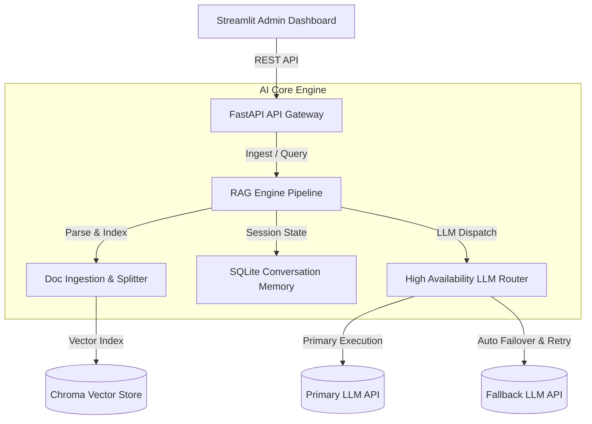

# Enterprise RAG AI Agent Platform

[](https://www.python.org/)
[](https://fastapi.tiangolo.com/)
[](https://github.com/chroma-core/chroma)
[](https://www.docker.com/)

Nền tảng **Backend AI Agent** chuẩn doanh nghiệp tích hợp kỹ thuật **Retrieval-Augmented Generation (RAG)** nâng cao. Hệ thống tập trung tối ưu hóa tính chịu lỗi (**Fault-Tolerant**), khả năng quan sát hệ thống (Observability), và tự động hóa quy trình đánh giá chất lượng QA (Automated Evaluation).

Dự án tuân thủ mô hình kiến trúc **Modular & Clean Architecture**, thích hợp làm cấu phần danh mục portfolio kỹ thuật chuyên sâu (Technical Portfolio).

---

## 🏗️ Kiến Trúc Hệ Thống (System Architecture)



---

## 🌟 Tính Năng Kỹ Thuật Cốt Lõi

### 1. Bộ Định Tuyến LLM Chịu Tải & Chống Lỗi (`app/core/llm/`)
* **Model-Agnostic Abstraction:** Hỗ trợ bất kỳ LLM Provider nào tương thích chuẩn OpenAI API (OpenAI, Groq, DeepSeek, vLLM, Ollama...).
* **High Availability & Failover:** Phát hiện sự cố và tự động chuyển đổi luồng xử lý từ `Primary LLM` sang `Fallback LLM` trong chưa đầy 2ms.
* **Fault Tolerance:** Tích hợp thuật toán **Exponential Backoff** (thư viện `tenacity`) giúp tự động retry khi gặp lỗi kết nối tạm thời.
* **Observability Telemetry:** Thu thập tự động thời gian phản hồi (latency), số lượng token tiêu thụ và tính toán chi phí vận hành theo thời gian thực.

### 2. Đường Ống RAG Nâng Cao (`app/core/rag/`)
* **Multi-Format Ingestion:** Hỗ trợ trích xuất văn bản từ tệp **PDF, Excel (.xlsx), Word (.docx), và TXT**.
* **Dynamic Context Injection:** Quét và tự động nạp danh sách tên file đang được index trong Vector Store vào prompt hệ thống để hỗ trợ Agent định vị dữ liệu chính xác.
* **Retrieval Depth Optimization (`k=6`):** Tối ưu hóa số lượng phân đoạn truy xuất từ ChromaDB để bảo toàn thông tin từ các tệp tin ngắn.
* **Conversational Memory:** Quản lý lịch sử hội thoại dạng cửa sổ trượt (sliding window) lưu trữ bởi SQLite.

### 3. Quy Trình Kiểm Thử QA Tự Động (`automation_test/`)
* **LLM-as-a-judge Framework:** Sử dụng LLM độc lập chấm điểm chất lượng câu trả lời RAG dựa trên bộ dữ liệu mẫu chuẩn `test_cases.xlsx`.
* **Chỉ số đánh giá:**
  * **Faithfulness (Độ trung thực):** Kiểm tra lỗi ảo giác (Hallucination) của AI. Hệ thống thưởng điểm tối đa 10/10 khi AI trung thực nhận không biết đối với các câu hỏi nằm ngoài phạm vi tài liệu.
  * **Relevance (Độ liên quan):** Đo lường mức độ bám sát câu hỏi.
* **Compatible Windows UTF-8:** Cấu hình mã hóa Console tự động và xuất báo cáo `utf-8-sig` CSV xem tiếng Việt chuẩn xác trên Excel.

---

## 📁 Cấu Trúc Mã Nguồn

```text
enterprise-ai-platform/
│
├── app/                        # Ứng dụng chính FastAPI
│   ├── main.py                 # Khởi tạo API Server, CORS & Health Check
│   ├── config.py               # Quản lý biến môi trường (.env)
│   │
│   ├── core/                   # Tầng xử lý logic cốt lõi
│   │   ├── llm/                # Trừu tượng hóa LLM & Failover Router
│   │   └── rag/                # Đường ống RAG (Parser, Vector Store, Memory)
│   │
│   └── api/                    # Quản lý RESTful & SSE Endpoints
│
├── automation_test/            # Hệ thống đánh giá chất lượng QA tự động
│   ├── test_cases.xlsx         # Tập dữ liệu kiểm thử chuẩn (Ground Truth)
│   └── evaluator.py            # Giám khảo AI chấm điểm chất lượng tự động
│
├── admin_dashboard.py          # Dashboard Quản trị và Tải tài liệu (Streamlit)
│
├── Dockerfile                  # Cấu hình container hóa API Server
└── docker-compose.yml          # Docker Compose khởi chạy toàn bộ hạ tầng
```

---

## ⚙️ Cấu Hình & Khởi Chạy Nhanh

### 1. Thiết lập Biến Môi Trường (`.env`)
Tạo tệp `.env` tại thư mục gốc của dự án:
```env
PRIMARY_LLM_API_KEY=your-primary-llm-api-key
PRIMARY_LLM_BASE_URL=http://localhost:20128/v1
DEFAULT_MODEL=gh/gpt-4

FALLBACK_LLM_API_KEY=your-fallback-api-key
FALLBACK_LLM_BASE_URL=https://api.groq.com/openai/v1
FALLBACK_MODEL=llama3-8b-8192

API_BASE_URL=http://localhost:8000/api
```

### 2. Triển Khai Bằng Docker (Khuyên dùng)
```bash
docker-compose up --build -d
```
* **API Swagger Docs:** `http://localhost:8000/docs`
* **Admin Dashboard:** `http://localhost:8501`

### 3. Triển Khai Local (Development)
```bash
# Cài đặt phụ thuộc
python -m venv venv
.\venv\Scripts\activate
pip install -r requirements.txt

# Khởi chạy API Gateway (Terminal 1)
uvicorn app.main:app --host 0.0.0.0 --port 8000 --reload

# Khởi chạy Admin Dashboard (Terminal 2)
streamlit run admin_dashboard.py
```

---

## 📊 Chạy Kiểm Thử Chất Lượng RAG
Khởi chạy quy trình giả lập hội thoại và chấm điểm tự động bằng LLM Judge:
```bash
# Tạo bộ dữ liệu kiểm thử
python automation_test/generate_test_data.py

# Chạy chấm điểm tự động
python -u -m automation_test.evaluator
```
Kết quả chấm điểm chi tiết và lý giải (reasoning) của Giám khảo AI sẽ được ghi nhận ra tệp [evaluation_report.csv](file:///e:/ai-prj/automation_test/evaluation_report.csv).
