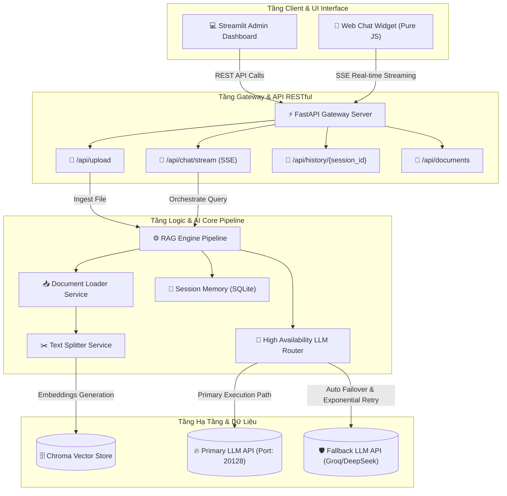

# 🚀 Enterprise AI Agent Platform

[](https://www.python.org/)
[](https://fastapi.tiangolo.com/)
[](https://github.com/chroma-core/chroma)
[](https://streamlit.io/)
[](https://www.docker.com/)

Một nền tảng **Enterprise AI Agent** toàn diện, hiệu năng cao và sở hữu khả năng chống chịu lỗi (**Fault-Tolerant**) vượt trội. Hệ thống được xây dựng trên hệ sinh thái Python hiện đại (FastAPI, LangChain, ChromaDB, Streamlit) và thiết kế tuân thủ nghiêm ngặt các tiêu chuẩn kiến trúc **Modular & Clean Architecture** cấp sản phẩm (Production-Grade).

Nền tảng này giải quyết triệt để các bài toán **Retrieval-Augmented Generation (RAG)** quy mô lớn, tích hợp bộ định tuyến LLM chịu tải cao tự động ứng biến sự cố (**High-Availability Failover Router**), đi kèm hệ thống kiểm thử QA tự động hóa chất lượng câu trả lời bằng mô hình trí tuệ nhân tạo độc lập (**LLM-as-a-judge**).

---

## 🏗️ Kiến Trúc Hệ Thống (System Architecture)

Nền tảng được thiết kế theo mô hình **Modular & Clean Architecture**, tách biệt hoàn toàn giữa các tầng nghiệp vụ để đảm bảo khả năng mở rộng (scalability) và dễ dàng bảo trì:



---

## 🌟 Các Tính Năng Đột Phá Chuẩn Enterprise

### 1. Bộ Định Tuyến LLM Chịu Tải & Chống Lỗi Cao (`app/core/llm/`)
* **Độc Lập Mô Hình (Model-Agnostic):** Tương thích 100% chuẩn OpenAI API, dễ dàng tích hợp với OpenAI, Groq, vLLM, Ollama, LM Studio, DeepSeek...
* **High Availability (HA) & Failover:** Tự động điều hướng cuộc gọi API. Khi nhà cung cấp chính (`Primary LLM`) gặp lỗi (Rate Limit, quá số Token, sự cố mạng), hệ thống tự động chuyển đổi luồng trong **chưa đầy 2 miliseconds** sang nhà cung cấp dự phòng (`Fallback LLM`).
* **Resilience (Khả năng phục hồi):** Tích hợp thuật toán **Exponential Backoff** thông qua thư viện `tenacity` để tự động thử lại (Retry) khi gặp sự cố mạng tạm thời.
* **Đo Lường Hệ Thống (Observability):** Ghi nhận chi tiết thời gian phản hồi (latency), số lượng Token tiêu thụ và chi phí vận hành trên từng truy vấn.

### 2. Đường Ống RAG Nâng Cao & Tối Ưu Hóa Tìm Kiếm (`app/core/rag/`)
* **Hỗ trợ đa định dạng tài liệu:** Tự động phân tích và trích xuất dữ liệu từ các định dạng phức tạp như **PDF, Excel (`.xlsx`), Word (`.docx`), TXT**.
* **Bơm ngữ cảnh thông minh (Dynamic Filename Context):** Hệ thống tự động quét và nạp danh sách tên file đang được index trong ChromaDB vào Prompt của AI Agent, giúp mô hình luôn tìm kiếm bằng từ khóa chính xác nhất (ví dụ: truy tìm chính xác CV của ứng viên thay vì đoán mò).
* **Độ sâu tìm kiếm tăng cường (`k=6`):** Tối ưu hóa số lượng phân đoạn truy xuất từ **3 lên 6 phân đoạn**, giúp thông tin cốt lõi trong các file ngắn không bao giờ bị dìm bởi các tệp lớn.
* **Conversational Memory:** Quản lý lịch sử hội thoại dạng cửa sổ trượt (sliding window) lưu trữ bằng SQLite để lưu giữ trọn vẹn ngữ cảnh.

### 3. Hệ Thống Đánh Giá Tự Động QA & RAG (`automation_test/`)
* **LLM-as-a-judge Framework:** Sử dụng mô hình ngôn ngữ lớn làm "giám khảo độc lập" tự động chấm điểm chất lượng chatbot dựa trên bộ dữ liệu mẫu chuẩn `test_cases.xlsx`.
* **Chỉ số đánh giá chuyên sâu:**
  * **Faithfulness (Độ trung thực):** Đánh giá chatbot có trả lời dựa trên tài liệu hay tự bịa đặt (hallucination). Thưởng tối đa 10/10 điểm khi chatbot trung thực báo không tìm thấy thay vì nói bừa.
  * **Answer Relevance (Độ liên quan):** Đo lường mức độ bám sát và trả lời trực diện câu hỏi của người dùng.
* **Windows Console Compatibility:** Tích hợp bộ chuyển đổi mã hóa Console UTF-8 tự động và định dạng xuất báo cáo `utf-8-sig` giúp xem báo cáo tiếng Việt sắc nét trên Excel.

---

## 📁 Cấu Trúc Mã Nguồn (Directory Blueprint)

```text
enterprise-ai-platform/
│
├── app/                        # Thư mục ứng dụng FastAPI chính
│   ├── main.py                 # Khởi tạo API Server, CORS Middleware & Health Checks
│   ├── config.py               # Quản lý cấu hình dự án từ tệp .env
│   │
│   ├── core/                   # Tầng chứa logic xử lý cốt lõi
│   │   ├── llm/                # Quản lý trừu tượng hóa LLM & Failover Router
│   │   │   ├── base.py         # Interface định nghĩa cấu trúc LLM Provider
│   │   │   ├── factory.py      # Khởi tạo động các Provider (OpenAI, Groq...)
│   │   │   ├── router.py       # Logic High Availability & Failover Routing
│   │   │   └── decorators/     # Decorator xử lý Caching, Retry & Telemetry
│   │   │
│   │   ├── rag/                # Đường ống RAG xử lý văn bản
│   │   │   ├── document_loader.py  # Xử lý PDF, Excel, Word, TXT
│   │   │   ├── text_splitter.py    # Cắt văn bản tối ưu hóa độ dài
│   │   │   ├── vector_store.py     # Kết nối và lập chỉ mục (index) ChromaDB
│   │   │   └── memory.py       # Quản lý Context Memory lưu bằng SQLite
│   │
│   └── api/                    # Quản lý các Router & Endpoints RESTful
│       ├── endpoints.py        # /upload, /chat, /chat/stream (SSE), /documents, /sessions
│       ├── schemas.py          # Validate đầu vào/ra bằng Pydantic v2
│       └── dependencies.py     # Quản lý vòng đời RAG Pipeline
│
├── automation_test/            # Luồng kiểm thử tự động hóa chất lượng AI
│   ├── test_cases.xlsx         # Dataset chứa bộ câu hỏi kiểm thử (Ground Truth)
│   ├── generate_test_data.py   # Script tự động tạo nhanh dữ liệu kiểm thử mock
│   └── evaluator.py            # Script chạy chấm điểm chất lượng QA tự động
│
├── admin_dashboard.py          # Web UI Quản trị, tải tài liệu & Chat (Streamlit)
│
├── Dockerfile                  # Cấu hình đóng gói container cho API Server
├── docker-compose.yml          # Triển khai đồng bộ toàn bộ hạ tầng (FastAPI + Streamlit)
├── requirements.txt            # Danh sách thư viện phụ thuộc của dự án
└── README.md                   # Tài liệu hướng dẫn dự án chuyên nghiệp
```

---

## ⚙️ Cấu Hình & Khởi Chạy Nhanh

### Bước 1: Thiết lập Biến Môi Trường (`.env`)
Tạo file `.env` tại thư mục gốc của dự án và điền đầy đủ các cấu hình sau:

```env
# --- Primary LLM Provider (OpenAI Compatible) ---
PRIMARY_LLM_API_KEY=your-primary-llm-api-key-here
PRIMARY_LLM_BASE_URL=http://localhost:20128/v1  # Cổng chạy mô hình cục bộ hoặc Gateway chính
DEFAULT_MODEL=gh/gpt-4                          # Tên mô hình chính

# --- Fallback LLM Provider (Ví dụ: Groq, DeepSeek) ---
FALLBACK_LLM_API_KEY=your-fallback-api-key-here
FALLBACK_LLM_BASE_URL=https://api.groq.com/openai/v1
FALLBACK_MODEL=llama3-8b-8192

# --- Cấu hình API Endpoint dành cho UI ---
API_BASE_URL=http://localhost:8000/api
```

---

### Cách 1: Triển khai bằng Docker (Khuyên dùng cho Production)
Yêu cầu đã cài đặt **Docker** và **Docker Compose** trên máy chủ của bạn.

```bash
# Khởi chạy toàn bộ hạ tầng (FastAPI Backend + Streamlit Frontend) ở chế độ chạy ngầm
docker-compose up --build -d
```

Sau khi khởi chạy thành công:
* **Backend API (Swagger Docs):** [http://localhost:8000/docs](http://localhost:8000/docs)
* **Admin Dashboard (Quản trị):** [http://localhost:8501](http://localhost:8501)
* **Health Check API:** `http://localhost:8000/health`

---

### Cách 2: Triển khai Local (Môi trường phát triển)
Yêu cầu hệ thống đã cài đặt sẵn **Python 3.10+**.

**1. Khởi tạo môi trường ảo và cài đặt thư viện:**
```bash
# Tạo môi trường ảo
python -m venv venv

# Kích hoạt môi trường ảo
# Trên Windows (PowerShell):
.\venv\Scripts\Activate.ps1
# Trên macOS/Linux:
source venv/bin/activate

# Cài đặt tất cả phụ thuộc
pip install -r requirements.txt
```

**2. Khởi động Backend API Server:**
```bash
uvicorn app.main:app --host 0.0.0.0 --port 8000 --reload
```

**3. Khởi động Giao diện Quản trị Admin (Chạy ở Terminal mới):**
```bash
streamlit run admin_dashboard.py
```

---

## 📊 Quy Trình Đánh Giá Chất Lượng RAG Tự Động

Để đảm bảo câu trả lời của AI luôn chính xác và không bị "ảo tưởng" (hallucination) sau mỗi lần cập nhật Prompt hoặc tải thêm tài liệu mới, hãy chạy quy trình kiểm thử tự động:

**1. Tạo bộ dữ liệu kiểm thử đầu vào:**
```bash
.\venv\Scripts\python.exe automation_test/generate_test_data.py
```

**2. Khởi chạy giám khảo AI chấm điểm chất lượng:**
```bash
.\venv\Scripts\python.exe -u -m automation_test.evaluator
```

**3. Xem kết quả phân tích chi tiết:**
* Điểm số chất lượng trung bình sẽ được hiển thị ngay trên màn hình terminal.
* Toàn bộ lịch sử kiểm thử, độ trễ và lý do chấm điểm (reasoning) được xuất trực tiếp ra file [evaluation_report.csv](file:///e:/ai-prj/automation_test/evaluation_report.csv) chuẩn mã hóa để xem tiếng Việt hiển thị tuyệt đẹp trên Excel.

---

## 🛠️ Công Nghệ Sử Dụng (Tech Stack)

* **Backend core:** FastAPI, Uvicorn, Pydantic v2.
* **AI & LLM Orchestration:** LangChain, OpenAI SDK, Tenacity (Auto-Retry), Tiktoken.
* **Vector Database:** ChromaDB (Local SQLite-backed persistent vector store).
* **Document Parser:** PyPDF2, OpenPyXL (Excel reader), Docx2txt (Word parser).
* **Data Visualization & UI:** Streamlit (với giao diện ChatGPT-style Sidebar cao cấp).
* **Deployment & DevOps:** Docker, Docker Compose.
